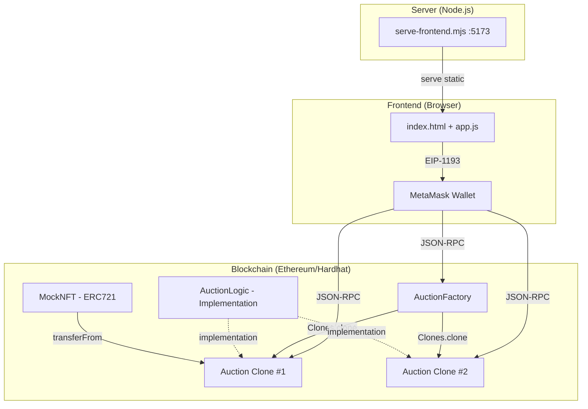
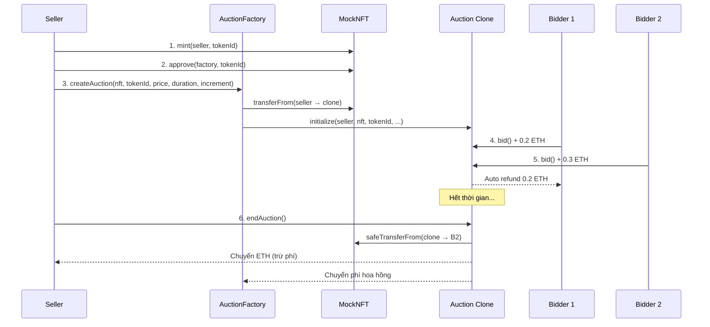

# BÁO CÁO DỰ ÁN: HỆ THỐNG ĐẤU GIÁ NFT PHI TẬP TRUNG (Auction DApp)

> **Ngày báo cáo:** 02/05/2026  
> **Phiên bản:** 1.0.0  
> **Framework:** Hardhat 3 | Solidity 0.8.24 | Ethers v6

---

## MỤC LỤC

1. [Tổng quan dự án](#1-tổng-quan-dự-án)
2. [Công nghệ sử dụng](#2-công-nghệ-sử-dụng)
3. [Cấu trúc thư mục](#3-cấu-trúc-thư-mục)
4. [Kiến trúc hệ thống](#4-kiến-trúc-hệ-thống)
5. [Chi tiết Smart Contract](#5-chi-tiết-smart-contract)
6. [Frontend DApp](#6-frontend-dapp)
7. [Scripts hỗ trợ](#7-scripts-hỗ-trợ)
8. [Kiểm thử (Testing)](#8-kiểm-thử-testing)
9. [Quy trình Deploy & Vận hành](#9-quy-trình-deploy--vận-hành)
10. [Cơ chế phí và dữ liệu](#10-cơ-chế-phí-và-dữ-liệu)
11. [Cấu hình mạng Blockchain](#11-cấu-hình-mạng-blockchain)
12. [Ghi chú kỹ thuật quan trọng](#12-ghi-chú-kỹ-thuật-quan-trọng)

---

## 1. Tổng quan dự án

Hệ thống là một **DApp đấu giá NFT trên Ethereum**, cho phép:

- **Seller** (người bán) tạo phiên đấu giá cho NFT của mình
- **Bidder** (người mua) đặt giá bằng native ETH
- Khi phiên kết thúc: NFT chuyển cho người thắng, ETH chia cho seller và nền tảng (hoa hồng)
- Nếu không ai đặt giá: NFT trả lại seller

### Các tính năng chính

| Tính năng | Mô tả |
|---|---|
| Factory Pattern | Tạo nhiều phiên đấu giá từ một contract mẫu (Clone) |
| Anti-sniping | Tự động gia hạn 2 phút nếu có bid sát giờ kết thúc |
| Hybrid Refund | Hoàn tiền tự động cho người bị outbid, fallback vào pending nếu thất bại |
| Hoa hồng nền tảng | Tính phí % trên giá thắng, chuyển cho feeRecipient |
| MetaMask Integration | Kết nối ví MetaMask, hỗ trợ nhiều tài khoản đóng vai trò khác nhau |

---

## 2. Công nghệ sử dụng

| Thành phần | Công nghệ | Phiên bản |
|---|---|---|
| Smart Contract | Solidity | 0.8.24 |
| Framework | Hardhat | 3.4.1 |
| Thư viện blockchain | Ethers.js | v6.16.0 |
| Thư viện contract | OpenZeppelin | 5.6.1 |
| Ngôn ngữ script/test | TypeScript | ~5.8.0 |
| Test framework | Mocha + Chai | 11.3.0 / 6.2.2 |
| Frontend | HTML/CSS/JS thuần + MetaMask | — |
| Frontend server | Node.js HTTP server tự viết | — |
| EVM version | Cancun | — |
| Optimizer | Enabled, 200 runs | — |

---

## 3. Cấu trúc thư mục

```
smart-contract-new/
├── contracts/                    # Smart contracts (Solidity)
│   ├── AuctionFactory.sol        # Contract điều phối (Factory Pattern)
│   ├── AuctionLogic.sol          # Logic đấu giá đơn lẻ (Implementation)
│   └── MockNFT.sol               # NFT mẫu cho demo/test
├── scripts/                      # Scripts vận hành
│   ├── deploy.ts                 # Deploy toàn bộ hệ thống
│   ├── serve-frontend.mjs        # HTTP server phục vụ frontend
│   └── test-frontend-flow.ts     # Mô phỏng luồng frontend
├── frontend/                     # Giao diện web
│   ├── index.html                # Trang chính
│   ├── app.js                    # Logic ứng dụng (480 dòng)
│   └── styles.css                # Giao diện CSS
├── test/                         # Bộ kiểm thử
│   └── Auction.test.ts           # 4 test cases
├── ignition/modules/             # Hardhat Ignition
│   └── AuctionSystem.ts          # Module deploy thay thế
├── artifacts/                    # ABI + bytecode (auto-gen sau compile)
├── cache/deployments/            # Địa chỉ contract sau deploy
├── hardhat.config.ts             # Cấu hình Hardhat
├── tsconfig.json                 # Cấu hình TypeScript
├── package.json                  # Dependencies & scripts
└── README.md                     # Hướng dẫn nhanh
```

---

## 4. Kiến trúc hệ thống



### Luồng hoạt động chính



---

## 5. Chi tiết Smart Contract

### 5.1 AuctionFactory.sol (88 dòng)

**Vai trò:** Contract điều phối trung tâm, quản lý toàn bộ phiên đấu giá.

**Kế thừa:** `Ownable` (OpenZeppelin)

| Hàm | Quyền | Mô tả |
|---|---|---|
| `constructor(impl, feeRecipient, feePercentage)` | Deploy | Khởi tạo với logic address và cấu hình phí |
| `createAuction(nft, tokenId, price, duration, increment)` | Public | Tạo clone mới, chuyển NFT vào clone, initialize |
| `setFeeConfig(recipient, percentage)` | onlyOwner | Cập nhật phí (tối đa 1000 bps = 10%) |
| `getAllAuctions()` | View | Trả về danh sách tất cả auction addresses |

**Biến state quan trọng:**
- `auctionImplementation` (immutable) — Địa chỉ AuctionLogic gốc
- `allAuctions[]` — Mảng tất cả clone đã tạo
- `auctionsBySeller[seller][]` — Mapping seller → danh sách auction
- `feeRecipient`, `feePercentage` — Cấu hình hoa hồng

**Events:** `AuctionCreated`, `FeeConfigUpdated`

---

### 5.2 AuctionLogic.sol (125 dòng)

**Vai trò:** Logic của một phiên đấu giá đơn lẻ (được clone bởi Factory).

**Kế thừa:** `Initializable` (OpenZeppelin)

**Enum:** `AuctionState { OPEN, ENDED }`

| Hàm | Mô tả |
|---|---|
| `initialize(...)` | Khởi tạo phiên (chỉ gọi 1 lần qua `initializer`) |
| `bid()` | Đặt giá (payable, nonReentrant) |
| `endAuction()` | Kết thúc phiên (nonReentrant) |
| `withdraw()` | Rút tiền pending (nonReentrant) |

**Quy tắc bid:**
- Seller không được tự bid
- Bid đầu tiên ≥ `startingPrice`
- Bid sau ≥ `highestBid + minBidIncrement`
- Nếu còn < 2 phút → gia hạn `endTime = block.timestamp + 2 minutes` (anti-sniping)

**Quy tắc endAuction:**
- Chỉ gọi được khi `block.timestamp >= endTime`
- Có winner → NFT cho winner, ETH chia seller + feeRecipient
- Không có winner → NFT trả lại seller

**Hybrid Refund:** Khi có bid mới, contract thử hoàn tiền trực tiếp cho người cũ (gas limit 30000). Nếu thất bại → cộng vào `pendingReturns[address]` để rút thủ công.

**Events:** `BidPlaced`, `AuctionEnded`, `Refunded`

---

### 5.3 MockNFT.sol (13 dòng)

**Vai trò:** ERC-721 mẫu cho demo/test.

- Token name: `MockNFT`, Symbol: `MNFT`
- `mint(address to, uint256 tokenId)` — external, không giới hạn quyền
- Chỉ dùng cho development, không phải production

---

## 6. Frontend DApp

### 6.1 Cấu trúc giao diện (index.html)

Giao diện gồm 5 section chính:

| Section | Chức năng |
|---|---|
| **0) Start here** | Kết nối MetaMask, load deployment, hiển thị trạng thái |
| **1) Assign roles** | Gán vai trò Seller/Bidder 1/Bidder 2 cho từng tài khoản MetaMask |
| **2) Seller panel** | Mint NFT → Approve → Tạo phiên đấu giá (one-click flow) |
| **3) Bidder panels** | Chọn phiên, nhập giá, đặt bid |
| **4) Auction monitor** | Xem thông tin phiên, kết thúc, fast-forward time, withdraw |

### 6.2 Logic ứng dụng (app.js — 480 dòng)

**Các module chính:**

1. **Kết nối ví (MetaMask)**
   - Switch/add chain Hardhat Local (chainId: 31337)
   - Tạo `BrowserProvider` + `Signer`
   - Tạo `JsonRpcProvider` trực tiếp cho `evm_increaseTime`

2. **Load ABI & Deployment**
   - Fetch ABI từ `/artifacts/contracts/.../*.json`
   - Fetch deployment từ `/cache/deployments/localhost.json` (ưu tiên)

3. **Quản lý vai trò**
   - `assignRole(roleKey)` — Gán tài khoản MetaMask hiện tại
   - `requireRole(roleKey)` — Kiểm tra trước mỗi thao tác

4. **Seller flow**
   - `mint()` → `approve()` → `createAuction()` — 3 giao dịch MetaMask liên tiếp

5. **Bidder flow**
   - Kiểm tra `minRequired` trước khi gửi
   - Gọi `bid({ value })` qua MetaMask

6. **Monitor**
   - Load chi tiết phiên (seller, highest bid, end time, state...)
   - Countdown timer cập nhật mỗi giây
   - Fast-forward time (chỉ local) + end auction
   - Withdraw pending refund

### 6.3 Giao diện CSS (styles.css)

- Layout responsive với CSS Grid
- Card-based design với border-radius
- Color-coded role cards (Seller: xanh dương, Bidder 1: xanh lá, Bidder 2: cam)
- Console log dark theme
- Font: Inter / Segoe UI

---

## 7. Scripts hỗ trợ

### 7.1 deploy.ts — Script deploy chính

**Trình tự deploy:**
1. Deploy `MockNFT`
2. Deploy `AuctionLogic` (implementation)
3. Deploy `AuctionFactory(logicAddress, feeRecipient=admin, feePercentage=500)`
4. Ghi kết quả ra `cache/deployments/{network}.json`

**Output JSON format:**
```json
{
  "network": "localhost",
  "chainId": 31337,
  "rpcUrl": "http://127.0.0.1:8545",
  "contracts": {
    "mockNFT": "0x...",
    "auctionLogic": "0x...",
    "auctionFactory": "0x...",
    "sampleAuction": null
  },
  "fee": {
    "recipient": "0x...",
    "percentageBps": 500
  }
}
```

### 7.2 serve-frontend.mjs — HTTP Server

- Port mặc định: `5173`
- Mount paths: `/` → frontend, `/artifacts`, `/cache`, `/node_modules`
- Chống path traversal
- Auto-serve `index.html` cho thư mục
- Cache-Control: no-store

### 7.3 test-frontend-flow.ts — Mô phỏng frontend

Chạy qua Hardhat, mô phỏng đúng trình tự frontend:
- Dùng 3 private key Hardhat cố định (Account #1, #2, #3)
- Seller: mint → approve → createAuction
- Bidder 1: bid 0.2 ETH
- Bidder 2: bid 0.3 ETH
- In trạng thái cuối cùng

---

## 8. Kiểm thử (Testing)

### File: `test/Auction.test.ts` (136 dòng, 4 test cases)

| # | Tên test | Mô tả |
|---|---|---|
| 1 | Tạo phiên đấu giá và khóa NFT | Verify clone được tạo, NFT chuyển vào clone |
| 2 | Bid và Hybrid Refund | Buyer1 bid → Buyer2 outbid → Buyer1 được hoàn tiền tự động |
| 3 | Seller nhận tiền (Full Lifecycle) | Tạo → Bid → Fast-forward time → End → Verify seller nhận ETH, winner nhận NFT |
| 4 | NFT trả lại nếu không ai bid | Tạo → Fast-forward → End → Verify NFT quay lại seller |

> **Lưu ý:** Trong test, Factory deploy với `feePercentage = 0` (không thu phí), khác với deploy script mặc định (5%).

### Chạy test

```bash
npm run test
# hoặc
npx hardhat test
```

### Ignition Module (thay thế)

File `ignition/modules/AuctionSystem.ts` cung cấp cách deploy qua Hardhat Ignition:
- Module 1: Deploy AuctionLogic
- Module 2: Deploy AuctionFactory với tham số `feeRecipient` và `feePercentage`

---

## 9. Quy trình Deploy & Vận hành

### 9.1 Chạy trên Local (Hardhat Network)

```bash
# Bước 1: Cài đặt dependencies
npm install

# Bước 2: Compile contracts
npm run compile

# Bước 3: Khởi chạy blockchain local (terminal 1)
npm run node

# Bước 4: Deploy contracts (terminal 2)
npm run deploy:localhost

# Bước 5: Chạy frontend server (terminal 3)
npm run frontend

# Bước 6: Mở trình duyệt
# http://127.0.0.1:5173
```

### 9.2 Sử dụng Frontend

1. Click **"Start (Auto Setup)"** — Kết nối MetaMask, load deployment
2. Gán vai trò:
   - Switch MetaMask sang Account #1 → Click **"Assign as Seller"**
   - Switch MetaMask sang Account #2 → Click **"Assign as Bidder 1"**
   - Switch MetaMask sang Account #3 → Click **"Assign as Bidder 2"**
3. Switch về Seller → Điền thông tin → Click **"Create Auction"** (3 giao dịch MetaMask)
4. Switch sang Bidder 1 → Chọn auction → Click **"Place Bid"**
5. Switch sang Bidder 2 → Đặt giá cao hơn → Click **"Place Bid"**
6. Trong **Auction Monitor**: Click **"Fast-forward + End"** hoặc chờ hết thời gian → **"End Auction"**

### 9.3 Deploy lên Sepolia (Testnet)

```bash
# Tạo file .env
SEPOLIA_RPC_URL=https://sepolia.infura.io/v3/YOUR_KEY
SEPOLIA_PRIVATE_KEY=YOUR_PRIVATE_KEY

# Deploy
npm run deploy:sepolia
```

Kết quả lưu tại `cache/deployments/sepolia.json`.

---

## 10. Cơ chế phí và dữ liệu

### 10.1 Phí hoa hồng nền tảng

```
feeAmount   = highestBid × feePercentage / 10000
sellerAmount = highestBid - feeAmount
```

- Mặc định: **500 bps = 5%**
- Giới hạn tối đa: **1000 bps = 10%**
- Chỉ tính khi có winner
- `feeAmount` gửi về `feeRecipient`, `sellerAmount` gửi cho seller

### 10.2 Gas fee

| Người thực hiện | Giao dịch | Trả gas |
|---|---|---|
| Seller | mint, approve, createAuction | ✓ |
| Bidder | bid | ✓ |
| Bất kỳ ai | endAuction | ✓ |
| Người rút | withdraw | ✓ |

### 10.3 Lưu trữ dữ liệu

| Loại | Vị trí | Nội dung |
|---|---|---|
| On-chain | Blockchain | State auction, cấu hình phí, sở hữu NFT |
| Off-chain | `artifacts/` | ABI + bytecode |
| Off-chain | `cache/deployments/` | Địa chỉ contract sau deploy |
| Database | **Không có** | Frontend đọc trực tiếp JSON + gọi blockchain |

---

## 11. Cấu hình mạng Blockchain

### hardhat.config.ts

```typescript
solidity: {
  version: "0.8.24",
  settings: {
    evmVersion: "cancun",
    optimizer: { enabled: true, runs: 200 }
  }
},
networks: {
  localhost: { url: "http://127.0.0.1:8545" },
  sepolia: { url: SEPOLIA_RPC_URL, accounts: [SEPOLIA_PRIVATE_KEY] }  // conditional
}
```

### Cấu hình MetaMask cho Local

| Thuộc tính | Giá trị |
|---|---|
| RPC URL | `http://127.0.0.1:8545` |
| Chain ID | `31337` (hex: `0x7a69`) |
| Currency | ETH |

### API sử dụng

- **Wallet API (EIP-1193):** `wallet_switchEthereumChain`, `wallet_addEthereumChain`, `eth_accounts`, `eth_requestAccounts`
- **Local JSON-RPC:** `evm_increaseTime`, `evm_mine` (chỉ local, cho fast-forward)

